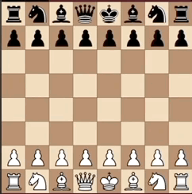
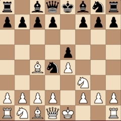
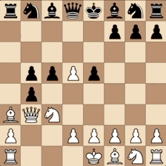
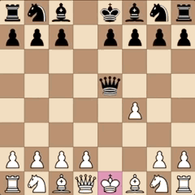
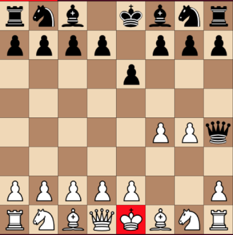

# **CHESSMATES**

A chess app made to play on **one** device between friends. Chessmates implements a pass-and-play functionality which inverts the board so that the players can pass the phone between each other allowing the players to play side-by-side.

* [<strong>CHESSMATES</strong>](#chessmates)
* [<strong>Getting Started</strong>](#getting-started)
		* [<strong>Prerequisities</strong>](#prerequisities)
		* [<strong>Installing</strong>](#installing)
* [<strong>Features</strong>](#features)
		* [<strong>Avatar Selection</strong>](#avatar-selection)
		* [<strong>Game Functionality</strong>](#game-functionality)
			* [<strong>Pawn Promotion</strong>](#pawn-promotion)
			* [<strong>Castling</strong>](#castling)
			* [<strong>Move Highlighting</strong>](#move-highlighting)
			* [<strong>Advanced Mode</strong>](#advanced-mode)
        
          

# **Getting Started**

### **Prerequisities**

Android Studio (3.3.2 or higher)

### **Installing**

Go to https://github.com/jkulskis/chessAndroid

Download project zip file

Unzip file

Open in Android Studio

# **Features**

### **Avatar Selection**

Chessmates allows each player to choose an avatar before the game starts.	Once the board inverts, the player who's current turn is on the bottom with their avatar.``

### **Game Functionality**

##### 	**Pawn Promotion**

Once a pawn reaches the starting row of the enemy player, the player's pawn my be immediately replaced by the player's choice of a queen, knight, rook, or bishop of the same color. The new piece replaces the pawn, as part of the same move. 

##### **Castling**

This may be done if the king has never moved, the rook involved has never moved,  the squares between the king and the rook are unoccupied, and the King is not checked. Once done, the King will move two tiles towards the rook and the rook will take place of tile the King passed over. 

##### **Move Highlighting**

Once a player selects a piece to move. The piece selected will have it's tile highlighted in blue and all available moves highlighted in green. 

If a legal  move will allow to take the other player's piece, the tile will appear pink under the enemy piece. 

If available, the castiling function is indicated by a cyan tile as an avaible move when the King is selected.

If checked, the King's tile will appear pink. If checkmated, the King's tile will appear red. 

##### 		**Advanced Mode**

A toggle switch on the main screen allows to play between Advanced Mode or not. When toggled on, the players will not recieve an indication of legal moves to make. Selected piece will still appear, as well as check and checkmate indicators. 

